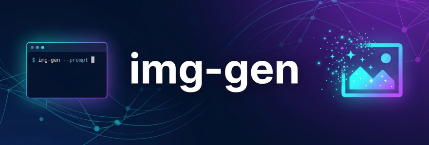
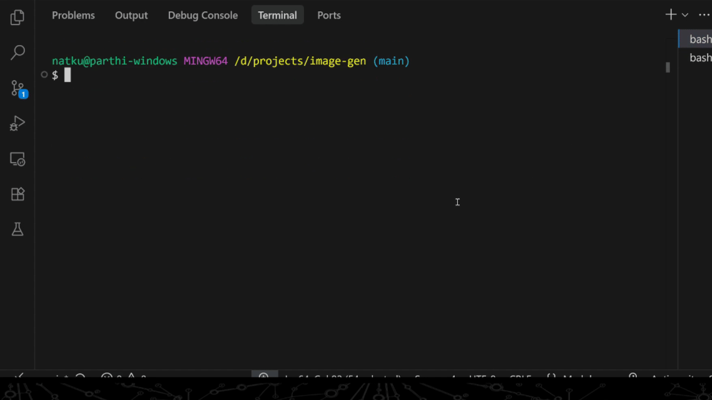
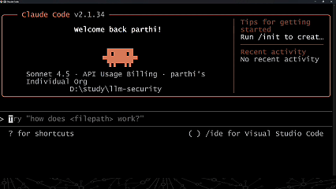

<p align="center">
    
</p>

A powerful CLI tool for generating AI images with optional watermarking support.



> [!NOTE]
> This tool also has a Claude skill that can be installed and used on Claude Code



## ✨ Features

- 🎨 **AI Image Generation** - Generate high-quality images using Nano Banana Pro (Google Gemini)
- 💧 **Watermark Support** - Add text or image watermarks with full customization
- 🔧 **Claude Code Integration** - Use as a skill in Claude Code

## Prerequisites

- [Go](https://go.dev/dl/) installed (version 1.22+ recommended)
- A Google AI Studio API Key ([Learn How to get this](https://ai.google.dev/gemini-api/docs/api-key))

## Quick Start

### Installation from Release

1. Download the binary from the [releases page](https://github.com/Parthipan-Natkunam/generate_image/releases)
2. Add it to your environment PATH
3. Set your API key (see below)

**Windows:**
```cmd
img-gen.exe --prompt "A beautiful landscape"
```

**Linux/macOS:**
```bash
img-gen --prompt "A beautiful landscape"
```

### Build from Source

1. **Clone the repository:**
   ```bash
   git clone https://github.com/Parthipan-Natkunam/generate_image.git
   cd generate_image
   ```

2. **Install dependencies:**
   ```bash
   go mod download
   ```

3. **Build the binary:**
   ```bash
   go build -o img-gen cmd/img-gen/main.go
   ```

4. **Set the API Key:**

   **Windows (Command Prompt):**
   ```cmd
   set NANOBANANA_API_KEY=your_api_key_here
   ```

   **Windows (PowerShell):**
   ```powershell
   $env:NANOBANANA_API_KEY="your_api_key_here"
   ```

   **Linux/macOS:**
   ```bash
   export NANOBANANA_API_KEY=your_api_key_here
   ```

## Usage

### Basic Image Generation

```bash
img-gen --prompt "A futuristic city with flying cars"
```

### With Custom Dimensions

```bash
img-gen --prompt "A cat in space" \
  --aspect-ratio "1:1" \
  --image-size "4K" \
  --output-dir ./my-images
```

## Watermark Features

### Text Watermarks

Add text watermarks with full customization:

```bash
img-gen --prompt "A futuristic city with flying cars" \
  --watermark-text "© 2026 MyBrand" \
  --watermark-position "bottom-right" \
  --watermark-opacity 0.7
```

**With custom styling:**
```bash
img-gen --prompt "A futuristic city with flying cars" \
  --watermark-text "© 2026 MyBrand" \
  --watermark-position "bottom-center" \
  --watermark-text-size 32 \
  --watermark-text-color "#FF0000" \
  --watermark-opacity 0.8 \
  --watermark-margin 30
```

### Image Watermarks

Add PNG, JPEG, or SVG logos as watermarks:

```bash
img-gen --prompt "A futuristic city with flying cars" \
  --watermark-image "./logo.png" \
  --watermark-position "top-right" \
  --watermark-scale 0.15 \
  --watermark-opacity 0.8
```

**SVG watermark (perfect scaling):**
```bash
img-gen --prompt "A futuristic city with flying cars" \
  --watermark-image "./logo.svg" \
  --watermark-position "bottom-right" \
  --watermark-scale 0.2
```

### Position Options

Place your watermark in any of these positions:
- `top-left`, `top-center`, `top-right`
- `left-center`, `center`, `right-center`
- `bottom-left`, `bottom-center`, `bottom-right`

## CLI Options

### Image Generation

| Flag | Type | Description | Default |
|------|------|-------------|---------|
| `--prompt` | string | Text prompt for image generation **(Required)** | - |
| `--aspect-ratio` | string | Aspect ratio: `1:1`, `16:9`, `4:3`, `3:2` | `16:9` |
| `--image-size` | string | Image size: `1K`, `2K`, `4K` | `2K` |
| `--output-dir` | string | Directory to save generated images | `./generated-images` |
| `--json` | bool | Output result in JSON format | `false` |
| `--describe` | bool | Output tool definition JSON (for integration) | `false` |

### Watermark Options

| Flag | Type | Description | Default |
|------|------|-------------|---------|
| `--watermark-text` | string | Text to use as watermark | - |
| `--watermark-image` | string | Path to watermark image (PNG, JPEG, SVG) | - |
| `--watermark-position` | string | Position on image (9 options) | `bottom-right` |
| `--watermark-opacity` | float | Opacity level (0.0-1.0) | `0.7` |
| `--watermark-margin` | int | Margin from edge in pixels | `20` |
| `--watermark-text-size` | int | Font size for text watermark | `24` |
| `--watermark-text-color` | string | Text color in hex (e.g., `#FFFFFF`) | `#FFFFFF` |
| `--watermark-scale` | float | Image watermark scale (0.1-1.0) | `0.2` |

> [!IMPORTANT]
> `--watermark-text` and `--watermark-image` are mutually exclusive. Use one or the other, not both.

## Examples

### Generate High-Resolution Image
```bash
img-gen --prompt "Photorealistic sunset over ocean" \
  --aspect-ratio "16:9" \
  --image-size "4K"
```

### Square Image with Text Watermark
```bash
img-gen --prompt "Modern minimalist design" \
  --aspect-ratio "1:1" \
  --watermark-text "© 2026 Designer" \
  --watermark-position "bottom-right"
```

### Product Image with Logo
```bash
img-gen --prompt "Luxury watch product photo" \
  --aspect-ratio "4:3" \
  --watermark-image "./brand-logo.svg" \
  --watermark-scale 0.12 \
  --watermark-position "top-right" \
  --watermark-opacity 0.9
```

### Protected Content with Center Watermark
```bash
img-gen --prompt "Premium stock photo" \
  --watermark-text "PREVIEW" \
  --watermark-position "center" \
  --watermark-text-size 48 \
  --watermark-opacity 0.3
```

### Batch Generation (Script Example)
```bash
#!/bin/bash
prompts=(
  "Mountain landscape at dawn"
  "Urban cityscape at night"
  "Tropical beach paradise"
)

for prompt in "${prompts[@]}"; do
  img-gen --prompt "$prompt" \
    --watermark-text "© 2026 MyCollection" \
    --watermark-position "bottom-right"
done
```

## Claude Code Integration

This tool includes a Claude skill for seamless integration with Claude Code.

1. **Install the skill:**
   ```bash
   # Copy the skill to your Claude skills directory
   cp -r ./claude-skill/generate-image ~/.claude/skills/
   ```

2. **Use in Claude Code:**
   ```
   /generate-image prompt="A futuristic robot" watermark_text="© AI Art"
   ```

3. **Get tool definition:**
   ```bash
   img-gen --describe
   ```

## Supported Formats

### Output Formats
- PNG (with transparency support)
- JPEG (high quality, 95%)

### Watermark Formats
- **PNG** - Raster images with transparency
- **JPEG** - Raster images (no transparency)
- **SVG** - Vector graphics with perfect scaling ✨

## Project Structure

```
generate_image/
├── cmd/img-gen/          # Main application entry point
├── pkg/
│   ├── generator/        # Image generation interface
│   ├── providers/        # Provider implementations (Nano Banana)
│   ├── watermark/        # Watermark functionality
│   │   ├── types.go      # Configuration and types
│   │   ├── position.go   # Position calculations
│   │   ├── text.go       # Text watermark rendering
│   │   ├── image.go      # Image watermark processing
│   │   └── watermark.go  # Main orchestration
│   └── schema/           # Tool definition schema
├── internal/config/      # Configuration management
└── claude-skill/         # Claude Code skill integration
```


### Building for Multiple Platforms
```bash
# Windows
GOOS=windows GOARCH=amd64 go build -o img-gen.exe cmd/img-gen/main.go

# Linux
GOOS=linux GOARCH=amd64 go build -o img-gen cmd/img-gen/main.go

# macOS
GOOS=darwin GOARCH=amd64 go build -o img-gen cmd/img-gen/main.go
```

## Troubleshooting

### API Key Not Set
```
Error: NANOBANANA_API_KEY environment variable is not set
```
**Solution:** Set the `NANOBANANA_API_KEY` environment variable (see Setup section).

### Watermark File Not Found
```
Error: watermark image file not found: logo.png
```
**Solution:** Check the file path is correct and the file exists.

### Unsupported Format
```
Error: unsupported watermark image format: .gif
```
**Solution:** Use PNG, JPEG, or SVG formats for watermarks.

### Invalid SVG
```
Error: invalid SVG file: [parse error]
```
**Solution:** Verify your SVG file is valid and well-formed.

## Contributing

Contributions are welcome! Please feel free to submit a Pull Request.

1. Fork the repository
2. Create your feature branch (`git checkout -b feature/amazing-feature`)
3. Commit your changes (`git commit -m 'Add some amazing feature'`)
4. Push to the branch (`git push origin feature/amazing-feature`)
5. Open a Pull Request

## License

This project is open source and available under the MIT License.

## Credits

- **Image Generation:** Powered by [Nano Banana Pro](https://nanobanana.pro) (Google Gemini)
- **SVG Rendering:** [oksvg](https://github.com/srwiley/oksvg) and [rasterx](https://github.com/srwiley/rasterx)
- **Font Rendering:** [golang.org/x/image/font](https://pkg.go.dev/golang.org/x/image/font)

## Support

- 🐛 [Report Issues](https://github.com/Parthipan-Natkunam/generate_image/issues)
- 💬 [Discussions](https://github.com/Parthipan-Natkunam/generate_image/discussions)
- 📖 [Documentation](https://github.com/Parthipan-Natkunam/generate_image/wiki)

---

Made with ❤️ by [Parthipan Natkunam](https://github.com/Parthipan-Natkunam)
